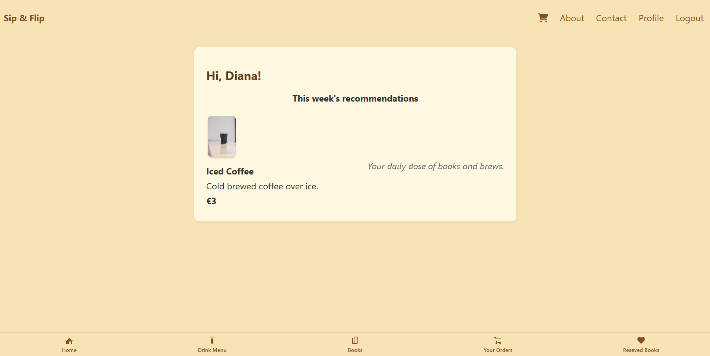

## Sip & Flip

Sip & Flip is a tailored web app designed exclusively for a specific café, offering a seamless ordering experience for customers. Whether you're immersed in a book or simply relaxing, you can order food and drinks straight from your phone without leaving your seat. The platform enhances in-café comfort by allowing users to place orders with just a few taps, ensuring a personalized and uninterrupted experience.



[🚀 Live Demo on Render](https://sipandflip.onrender.com)

## 💡Key Features

- 🍽 Browse and order drinks from a dynamic menu with their details

- 📚 Explore and borrow books through an integrated café library

- ☕ Enjoy both a digital café menu and a cozy book reservation system.

- 📚 Browse, search, and reserve books.

- 🔍 Filter books easily by title or author.

- 🔍 Filter drinks easily by name or description.

- 📱 Smooth experience across desktop and mobile devices.

# ⚙️ Implementation Outline

## Built with

- **Frontend**: HTML/CSS/JavaScript with EJS templates
- **Backend**: Node.js, Express.js
- **Templating**: Embedded JavaScript (EJS)
- **Styling**: plain CSS

## 🚀 Setup Instructions

### 1. Clone the repository

```bash
   git clone https://github.com/elhamatokhi/Sip-and-Flip.git

   cd sip-and-flip
```

2. Install dependencies

```bash
 npm install
```

3. Run the application

```bash
   node index.js
   The app will be live at http://localhost:3000
```

## Documentation

For more details, see the [Project Wiki](https://github.com/elhamatokhi/Sip-and-Flip/wiki)

## Image Attribution

- Book cover images are provided by [Open Library](https://openlibrary.org/developers/api) and are used under their usage guidelines.
- Drink images are custom or sourced appropriately [Co/Choc Cafe(Community)](https://www.figma.com/design/8A9mNCcVfKujV0qhss1QL7/Co-Choc-Cafe--Community-?node-id=79-818&p=f&t=YlkMrHr4OTZAOss1-0).

## License

This project is licensed under the [MIT License](https://mit-license.org/).
